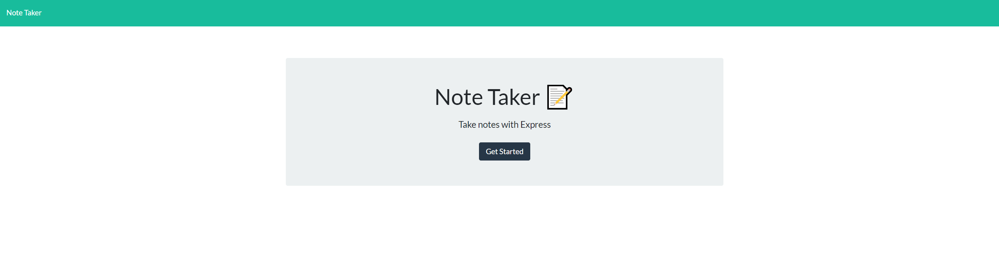
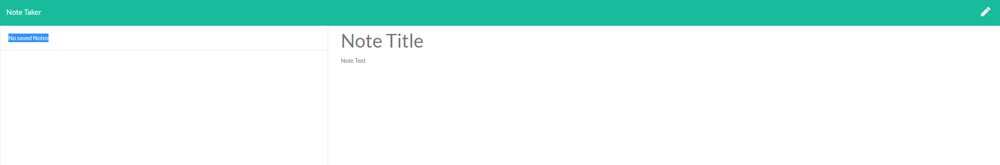
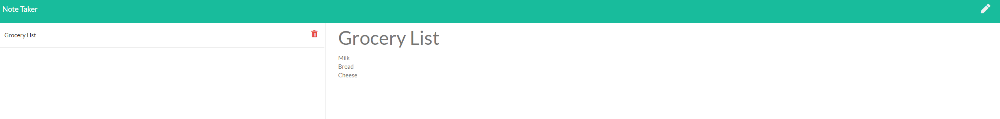

# Note-Taker

This app has been delpoyed to: https://aqueous-dusk-29885.herokuapp.com/notes

#

This is an app for taking notes. Once the user gets to the main page, they can click on the Get Started button to begin.

#

This will bring them to the page where they can start creating notes.

Start by entering a Title for the note the nmove on to eter the items for the notes.

#

Once the list is completed, hit the save icon on the top left. The list will then appear in the column on the right.

The user can click on previous lists to retrieve it at any time.

Once they have no more use for the list, they can use the trashcan icon to delete the list.
